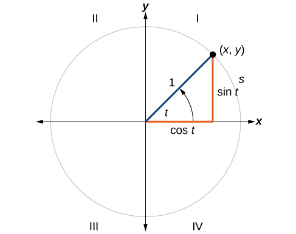
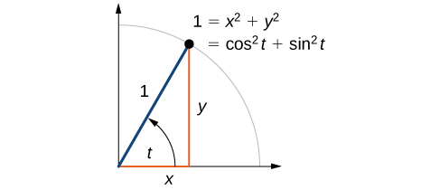
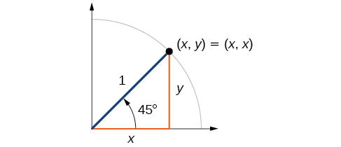
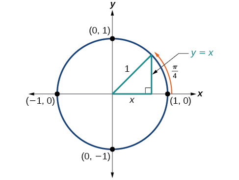
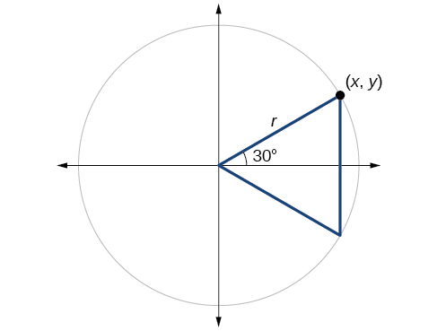
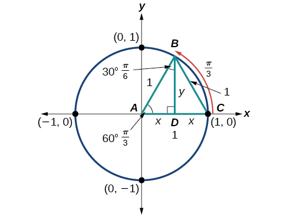
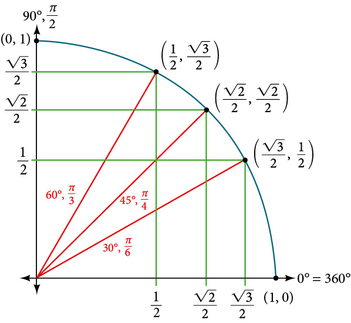
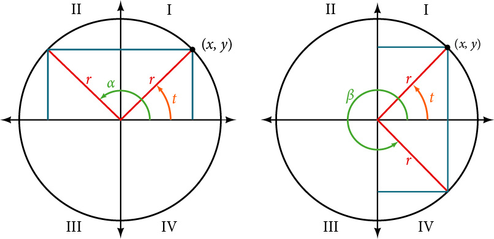
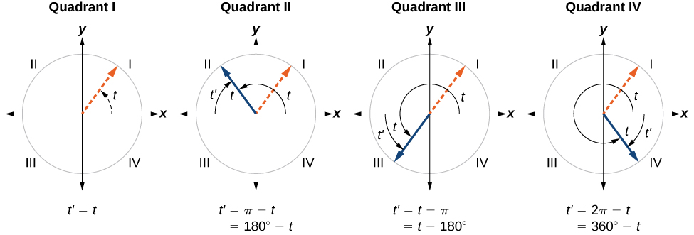
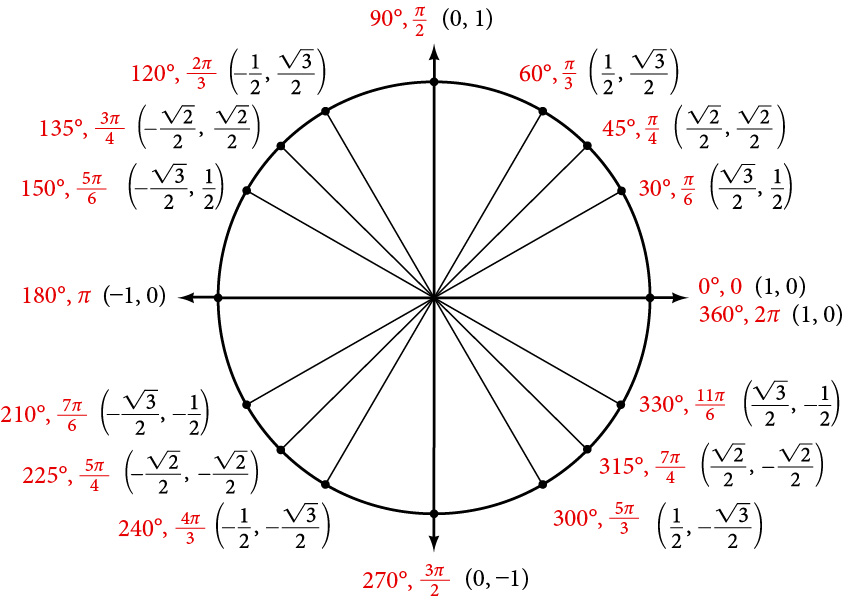

# Chapter 7: The Unit Circle: Sine and Cosine Functions
## 7.1 Right Angles
## 7.2: Right Triangle
## 7.3: Unit Circle
### Finding Trigonometric Functions Using the Unit Circle
- A unit circle is a circle that is centered at the origin with a radius of 1
- 
- The angle (in radians) that $t$ intercepts form an arc of length $s$. Using the formula $s = rt$, knowing that $r=1$, we see that $s = t$ for a unit circle.
- The coordinate plane is divided into four quarters/quadrants
- For any angle $t$, we can label the intersection of the terminal side and the unit circle as by its coordinates, $(x,y)$.
- The coordinates $x$ and $y$ will be the outputs of the trigonometric functions $f(t)=\cos t$ and $f(t)=\sin t$, respectively.
  - This means $x=\cos t$ and $y=\sin t$.
#### Unit Circle
- A **unit circle** has a center at $(0, 0)$ and a radius 1. In a unit circle, the length of the intercepted arc is equal to the radian measure of the central angle $t$
- Let $(x,y)$ be the endpoint on the unit circle of an arc of arc length $s$. The $(x, y)$ coordinates of this point can be described as functions of the angle
### Defining Sine and Cosine Functions from the Unit Circle
- Sine function relates a real number $t$ to the $y$-coordinate of the point where the corresponding angle intercepts the unit circle
  - Or, the sine of an angle $t$ equals the $y$-value of the endpoint on the unit circle of an arc of length $t$
- The **sine function** has an input and an output, the input is a measure of the angle, and its output is the $y$-coordinate of the corresponding point on the unit circle
- The **cosine function** of an angle $t$ equals the $x$-value of the endpoint on the unit circle of an arc of length $t$
#### Sine and Cosine Functions
- If $t$ is a real number and a point $(x, y)$ on the unit circle corresponds to a central angle $t$, then
  - $\cos t = x$
  - $\sin t = y$
#### How To
- Given a point $P (x, y)$ on the unit circle corresponding to an angle of $t$, find the sine and cosine
  1. The sine of $t$ is equal to the $y$-coordinate of point $P$: $\sin t = y$
  2. The cosine of $t$ is equal to the $x$-coordinate of point $P$: $\cos t = x$
### Finding Sines and Cosines of Angles on an Axis
- For quadrantal angles, the corresponding point on the unit circle falls on the $x$ or $y$-axis. In these cases, we can easily calculate cosine and sine from the values of $x$ and $y$
### The Pythagorean Identity
- The equation for a unit circle is $x^2 + y^2 = 1$. Because $x = \cos t$ and $y = \sin t$, we can substitute $x$ and $y$ to get $\cos^2t + \sin^2t = 1$
  - This equation is known as the Pythagorean Identity
  - 
- The Pythagorean Identity can be used to find the cosine of an angle if we know the sine, or vice versa. This equation gives us two solutions though, so we need to know what quadrant the angle is in
#### Pythagorean Identity
- The **Pythagorean Identity** states that, for any real number $t$,
  - $\cos^2t + \sin^2t = 1$
#### How To
- Given the sine of some angle $t$ and its quadrant location, find the cosine of $t$
  1. Substitute the known value of $\sin t$ into the Pythagorean Identity
  2. Solve for $\cos t$
  3. Choose the solution with the appropriate sign for the $x$-values in the quadrant where $t$ is located
### Finding Sines and Cosines of Special Angles
- We can also calculate sines and cosines of the special angles using the Pythagorean Identity
#### Finding Sines and Cosines of $45^{\circ}$ Angles
- Angles of $45^{\circ}$ (or $\frac{\pi}{4}$) are part of an isosceles triangle ($45^{\circ}-45^{\circ}-90^{\circ}$) , so the $x$ and $y$-coordinates of the corresponding point on the circle are the same
- Because the $x$ and $y$ values are the same, the sine and cosine values are also equal
- 
- At $t = \frac{\pi}{4}$ (45 degrees), the radius of the unit circle bisects the first quadrantal angle, which means that the radius lies along the line $y=x$. The unit circle has a radius equal to 1, so the right triangle formed by that line has sides $x$ and $y$, and a radius = 1
- 
- To solve for $x$ and $y$, we use the following steps
  - $x^2 + y^2 = 1$
  - $x^2 + x^2 = 1$ (substitute $y = x$)
  - $2x^2 = 1$ (combine like terms)
    - $x^2 = \frac{1}{2}$
    - $x = \pm\frac{1}{\sqrt{2}}$
  - $\cos t = \frac{1}{\sqrt{2}}, \sin t = \frac{1}{\sqrt{2}}$
    - rationalize denominators (multiple each side by $\frac{\sqrt{2}}{\sqrt{2}}$), becomes $\cos t = \frac{\sqrt{2}}{2}$ and $\sin t = \frac{\sqrt{2}}{2}$
#### Finding Sines and Cosines of $30^{\circ}$ and $60^{\circ}$ Angles
- To find the cosine and sine of $30^{\circ}$ (or $\frac{\pi}{6}$), draw a triangle inside the unit circle with one side at an angle of $30^{\circ}$, and another at an angle of $-30^{\circ}$. When these right triangles are combined into one large triangle, all three angles of the larger triangle will be $60^{\circ}$
- 
- Because all of the angles are equal, the sides are also equal. The vertical line has a length of $2y$, and since all sides are equal, $r = 2y$ or $y = \frac{1}{2}r$. Since $\sin t = y$, $\sin(\frac{\pi}{6}) = \frac{1}{2}r$
  - And since $r = 1$ in the unit circle, $\sin(\frac{\pi}{6}) = \frac{1}{2}$
- Using the Pythagorean Identity, you can find the cosine value
  - $\cos^2(\frac{\pi}{6}) + \sin^2(\frac{\pi}{6}) = 1$
  - $\cos^2(\frac{\pi}{6}) + (\frac{1}{2})^2 = 1$
  - $\cos^2(\frac{\pi}{6}) = \frac{3}{4}$
  - $\cos^2(\frac{\pi}{6}) = \frac{\sqrt{3}}{2}$
- So, the $(x, y)$ coordinates for the point on a circle of radius 1 at an angle of $30^{\circ}$ are $(\frac{\sqrt{3}}{2}, \frac{1}{2})$
- For $t = \frac{\pi}{3}$ (or $60^{\circ}$), the radius of the unit circle, 1, serves as the hypotenuse of a 30-60-90 degree right triangle, $BAD$, Angle $A$ has a measure of 60 degrees. At angle $B$, we draw an angle $ABC$ with a measure of 60 degrees. Then because all angles in a triangle must sum to 180, the measure of angle $C$ is 60 degrees.
  - Because each side of an equilateral triangle is the same length and we know that one side is the radius of the unit circle, all sides must be of length 1
- 
- Angle $ABD$ is 30 degrees (half of $ABC$) and $BD$ bisects $AC$. This means that $AD = \frac{1}{2}$, which is the $x$-coordinate of point $B$. This means our triangle $BAD$ has a hypotenuse of 1 and side $x$ of length $\frac{1}{2}$
- Using the Pythagorean theorem
  - $x^2 + y^2 = 1$
  - $(\frac{1}{2})^2 + y^2 = 1$
  - $y^2 = \frac{3}{4}$
  - $y = \pm\frac{\sqrt{3}}{2}$
- Commonly encountered angles in the first quadrant of the unit circle

| Angle  | 0 | $\frac{\pi}{6}$ or $30^\circ$ | $\frac{\pi}{4}$ or $45^\circ$ | $\frac{\pi}{3}$ or $60^\circ$ | $\frac{\pi}{2}$ or $90^\circ$ |
|--------|---|-------------------------------|-------------------------------|-------------------------------|-------------------------------|
| Cosine | 1 | $\frac{\sqrt{3}}{2}$          | $\frac{\sqrt{2}}{2}$          | $\frac{1}{2}$                 | 0                             |
| Sine   | 0 | $\frac{1}{2}$                 | $\frac{\sqrt{2}}{2}$          | $\frac{\sqrt{3}}{2}$          | 1                             |
- 
### Identifying the Domain and Range of Sine and Cosine Functions
- What are the smallest and largest numbers that can be inputs of the functions?
- There is no lower or upper limit to the angles that can be inputs/domain to the sine and cosine functions, they may be any real numbers
- The range of the sine and cosine functions are both $[-1, 1]$ (note: inclusive)
### Finding Reference Angles
- For any given angle in the first quadrant, there is an angle in the second quadrant with the same sine value. Because the sine value is the $y$-coordinate on the unit circle, the other angle with the same sine will have the same $y$-value, but the opposite $x$-value. This means its cosine value will be the opposite of the first angle's cosine value
- Similarly, there will be an angle in the fourth quadrant with the same cosine as the original angle, where the angle with the same cosine will share the same $x$-value, but have an opposite $y$-value (the sine is the opposite of the original angle's sine value)
- 
- The angle's reference angle is the acute angle $t$, formed by the terminal side of the angle $t$ and the horizontal axis.
- A reference angle is always an angle between 0 and 90 degrees, or 0 and $\frac{\pi}{2}$ radians
- 
#### How To
- Given an angle between 0 and $2\pi$, find its reference angle
  1. An angle in the first quadrant is its own reference angle
  2. For an angle in the second or third quadrant, the reference angle is $|\pi - t|$ or $|180^\circ - t|$
  3. For an angle in the first quadrant, the reference angle is $2\pi - t$ or $360^\circ - t$
  4. If an angle is less than 0 or greater than $2\pi$, add or subtract $2\pi$ as many times as needed to find an equivalent angle between 0 and $2\pi$
### Using Reference Angles
- Reference angles make it possible to evaluate trigonometric functions for angles outside of the first quadrant and can help find $(x, y)$ for those angles
#### Using Reference Angles to Evaluate Trigonometric Functions
- Can find cosine and sine of any angle in any quadrant if we know the cosine or sine of its reference angle. The absolute values of the cosine and sine of an angle are the same as those of the reference angle.
- The sign depends on the quadrant of the original angle
- The cosine will be positive or negative depending on the sign of the $x$-values in that quadrant
- The sine will be positive or negative depending on the sign of the $y$-values in that quadrant
#### How To
- Given an angle in standard position, find the reference angle, and the cosine and sine of the original angle
  1. Measure the angle between the terminal side of the given angle and the horizontal axis (that is the reference angle)
  2. Determine the values of the cosine and sine of the reference angle
  3. Give the cosine the same sign as the $x$-values in the quadrant of the original angle
  4. Give the sine the same sign as the $y$-values in the quadrant of the original angle
#### Using Reference Angles to Find Coordinates
- Special focus should be made to learn the $(x, y)$ coordinates of all the major angles in the first quadrant
- 
#### How To
- Given the angle of a point on a circle and the radius of the circle, find the $(x, y)$ coordinates of the point
  1. Find the reference angle by measuring the smallest angle to the $x$-axis
  2. Find the cosine and sine of the reference angle
  3. Determine the appropriate signs for $x$ and $y$ in the given quadrant

## 7.4: The Other Trigonometric Functions
