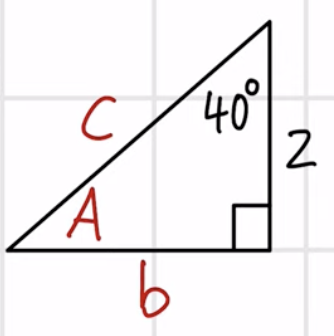
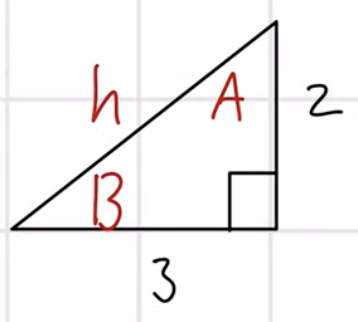

## Lecture 15: Right Triangles
#### Trig Functions (SohCahToa)
- $\sin(\theta) = \frac{\text{opp}}{\text{hyp}}$
- $\csc(\theta) = \frac{\text{hyp}}{\text{opp}}$
- $\cos(\theta) = \frac{\text{adj}}{\text{hyp}}$
- $\sec(\theta) = \frac{\text{hyp}}{\text{adj}}$
- $\tan(\theta) = \frac{\text{opp}}{\text{hyp}}$
- $\cot(\theta) = \frac{\text{hyp}}{\text{opp}}$

#### Right Triangles
- Right triangles always contain a $90^\circ$ angle
- Pythagorean theorem: $a^2 + b^2 = c^2$
  - Where $c$ = hypotenuse
  - "The sum of the two legs squared is equal to the hypotenuse squared"
- The sum of the interior angles is $180^\circ$
  - This goes for any triangle, not just right triangles
- Note on "opposite vs adjacent"
  - When we say "opposite" we are talking about the side that is "subtended"/captured by the angle
  - The side that is right next to the angle (and not the hypotenuse) is the "adjacent" side
  - Which side is considered which will change!
- Whenever you are trying to find a missing variable, the number of missing variables you have should equate to the number of equations you need to solve for those variables
  - You should arrange your equations so that you only have one unknown variable in the equation

#### Examples
1. 
   - We could simply subtract 40 and 90 from 180 to find the remaining angle, but we can also use the trig functions
   - Remember if you are working with degrees, your calculator needs to be in "Degree" mode, instead of "Radian"
   - $\tan(40^\circ)$
     - Tangent is equal to opposite over adjacent
     - $\tan(40^\circ) = \frac{b}{2}$
     - $2\tan(40^\circ) = b$
     - $b \approx 1.68$
   - Now that we have two sides, we could solve for the hypotenuse using the pythagorean theorem, but we can also do that with trig functions
   - $\sin(40^\circ)$
     - Sine is equal to opposite over hypotenuse
     - $\sin(40^\circ) = \frac{1.68}{c}$
     - $c \cdot \sin(40^\circ) = 1.68$
     - $c = \frac{1.68}{\sin(40^\circ)}$
     - $c \approx 2.61$
   - To find a missing angle, recall the inverse properties from previous lectures
     - $f^{-1}(f(x)) = x$
     - $f(f^{-1}(x)) = x$
   - $\cos(A)$
     - Cosine is equal to adjacent over hypotenuse
     - $\cos(A) = \frac{1.68}{2.61}$
     - $\cos(A) \approx 0.64$
     - Use the property of inverses to apply composition
     - $\cos^{-1}(\cos(A)) = \cos^{-1}(0.64)$
     - $\cos^{-1}(0.64) \approx 50$
       - We get a slightly different answer in our calculator because of our rounding
       - Round to the nearest degree
2. 
   - $\tan(A) = \frac{3}{2}$
     - $A = \tan^{-1}(\frac{3}{2})$
     - $A \approx 56^\circ$
   - $\tan(B) = \frac{2}{3}$
     - $B = \tan^{-1}(\frac{2}{3})$
     - $B \approx 34$
   - $\sin(A) = \frac{3}{H}$
     - $H\sin(A) = 3 \to H = \frac{3}{\sin(A)}$
     - $H \approx 3.6$