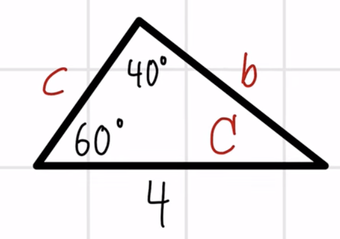
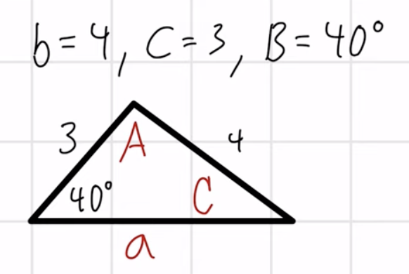
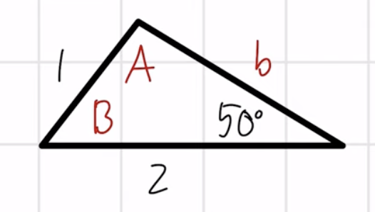

## Lecture 16: Law of Sines
- When you don't have a right angle, but you still want to find the angles and the sides
- Use the capital letter to represent the angle inside the triangle, use the lowercase letter to represent the sides
  - You also typically name the side the same letter (but lowercase) that is opposite the angle
- Depending on what information you are given in the triangle, you will use the law of sines
- The number of unknown variables is the number of equations that you need. Make sure there is only one unknown variable in your equation
- For the law of sines, you want to have a pair of angle and side together. If you don't have a pair, you will have two unknown variables in your equation
- For triangles, we still know that the sum of interior angles is $180^\circ$
- Construct an equation with one unknown, then use algebra to isolate and solve
### Formula
- For any triangle with sides $a, b, c$ and opposite angles $A, B, C$
- $\frac{\sin(A)}{a} = \frac{\sin(B)}{b} = \frac{\sin(C)}{c}$
- This formula states that the ratio of a side's length to the sine of its opposite angel is the same for all three sides.
- Use this formula when you know
  - Two angles and one side
  - Two sides and a non-included angle (ambiguous case)
#### Examples
1. 
   - Do not want to use $\frac{\sin(60^\circ)}{b} = \frac{\sin(C)}{c}$, too many unknown variables in the same equation
   - Use the pair of angle A and side a
   - $\frac{\sin(40^\circ)}{4} = \frac{\sin(60^\circ)}{b}$
     - We know that $\sin(60) = \frac{\sqrt{3}}{2}$
     - $b \cdot \sin(40) = \sin(60) \cdot 4$
     - $b = \frac{4 \cdot \sin(60)}{\sin(40)}$
     - $b \approx 5.4$
   - Using sum of angles, we know side C = 80
   - $\frac{\sin(80)}{c} = \frac{\sin(60)}{5.4}$
     - $c \cdot \sin(60) = 5.4 \cdot \sin(80)$
     - $c = \frac{5.4 \cdot \sin(80)}{\sin(60)}$
     - $c \approx 6.14$
2. 
   - $b = 4, c = 3, B = 40^\circ$
   - $\frac{\sin(40)}{4} = \frac{\sin(C)}{3}$
   - $3 \cdot \frac{\sin(40)}{4} = \sin(C) \to \frac{3 \cdot \sin(40)}{4}$
   - $C = \sin^{-1}(\frac{3\sin(40)}{4})$
   - $C \approx 29$
   - $A \approx 111$ (using sum of angles)
   - $\frac{\sin(29)}{3} = \frac{\sin(111)}{a}$
     - $a = \frac{3\sin(111)}{\sin(29)}$
     - $a \approx 5.81$
3. 
   - $a = 2, c = 1, C = 50^\circ$
   - $\frac{\sin(50)}{1} = \frac{\sin(A)}{2}$
     - $2\sin(50) = \sin(A)$
     - $A = \sin^{-1}(2\sin(50))$
     - $A \approx 1.5$ (This is not in the domain of sine inverse)
       - In this case, we are dealing with something that is not a valid triangle
