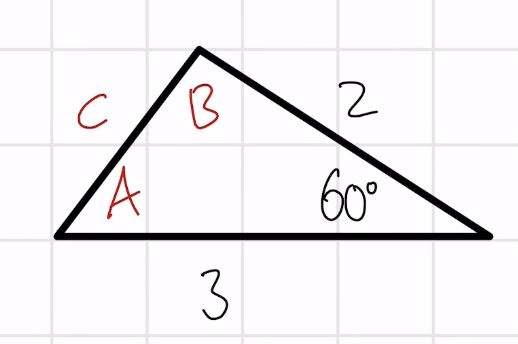

## Lecture 17: Law of Cosines
- Similar ideas to the Law of Sines, only difference is that we are using a different formula
- We want to use the formula that only leaves us with one unknown variable
- This is for when we are dealing with triangles that are not right triangles, if you have a right triangle, use the trig ratios
### Formula
- $a^2 = b^2 + c^2 - 2bc\cos(A)$
- $b^2 = a^2 + c^2 - 2ac\cos(B)$
- $c^2 = a^2 + b^2 - 2ab\cos(C)$
- These formulas generalize the Pythagorean theorem
- Use these formulas when you know 
  - All three sides
  - Two sides and the included angle
#### Examples
1. 
   - $a = 2, b = 3, C = 60^\circ$
   - $c^2 = 2^2 + 3^2 - 2\cdot2\cdot3\cos(60)$
   - $c^2 = 13 - 12\cos(60)$
   - $c^2 = 13 - 6$
   - $c = \sqrt{7}$
   - $2^2 = 3^2 + (\sqrt{7})^2 - 2 \cdot 3 \cdot \sqrt{7} \cdot \cos(A)$
     - Remember that when we are solving for an angle, we need to remember our cancellation property/inverse property
   - $4 = 16 - 6\sqrt{7}\cos(A)$
   - $\frac{-12}{-6\sqrt{7}} = \cos(A) \to \frac{2}{\sqrt{7}} = \cos(A)$
   - $A = \cos^{-1}(\frac{2}{\sqrt{7}})$
   - $A \approx 41^\circ$
   - $3^2 = 2^2 + \sqrt{7}^2 - 2(2)(\sqrt{7})\cos(B)$
   - $9 = 4 + 7 - 4\sqrt{7}\cos(B)$
   - $\frac{-2}{-4\sqrt{7}} = \cos(B)$
   - $B = \cos^{-1}(\frac{1}{2\sqrt{7}})$
   - $B \approx 79$