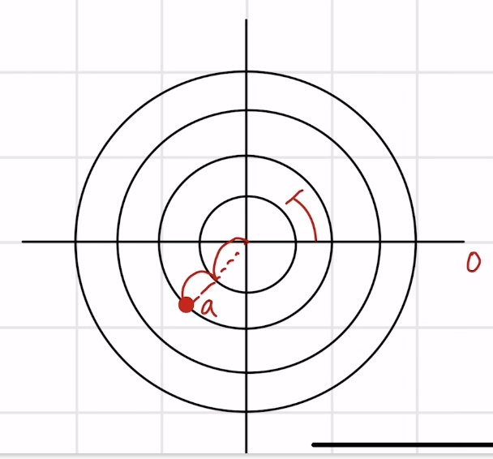
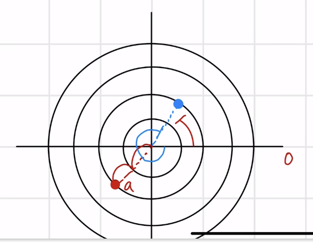
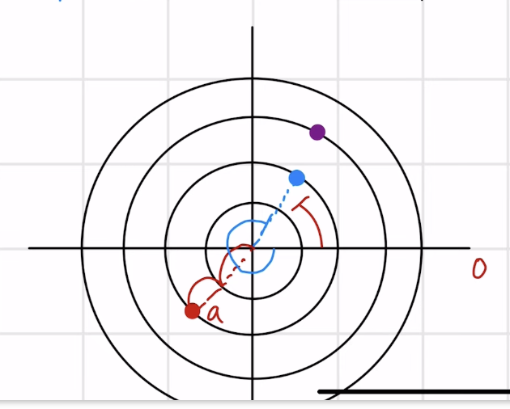
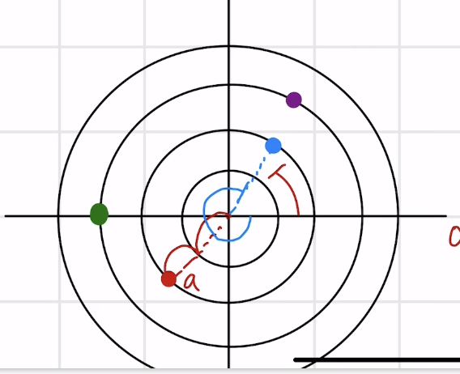
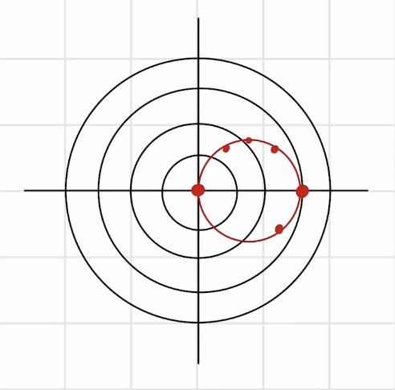
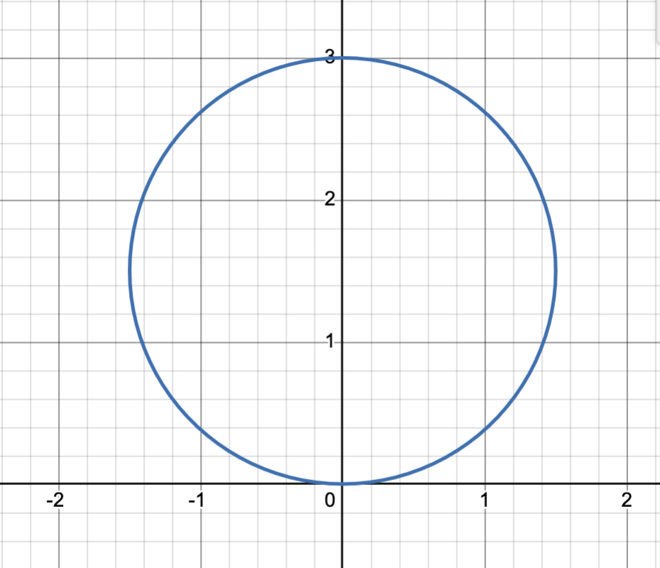

## Lecture 25: Polar Coordinates & Equations
- Polar coordinates are completely different than the rectangular coordinate system we have been dealing with to this point
  - Rectangular coordinate system involves x, y coordinates and that is how you identify a particular point
- Instead of x and y, polar coordinates are $r$ $\theta$
- Just like how we started with our unit circle, we start at zero, plot $theta$, and then $r$ is how far we are going to go in the direction of $theta$
- For polar coordinates, we have to be mindful of $\theta$ (this is similar to $x,y$ coordinates)
  - When we rotate clockwise: $\theta \lt 0$ (negative)
  - When we rotate counterclockwise: $\theta \gt 0$ (positive)
- With polar coordinates, we need to be mindful of $r$
  - $r \gt 0$: we are "moving forward" (positive)
  - $r \lt 0$: we are "moving backward" (negative)
  - Everything we do is going to start at 0
- The direction we are "facing" is always in the positive direction, whatever is "behind" us is in the negative direction
#### Examples (Polar Coordinates)
- Plot the following coordinates
1. $(-2, \frac{\pi}{4})$
   - 
   - Note how we rotate counter-clockwise (because $\theta$ is positive), but then we move "backwards" (because $r$ is negative) from the direction we are facing
2. $(2, -\frac{5\pi}{3}$
   - 
   - Because $\theta$ is negative, we rotate in the clockwise direction $\frac{5\pi}{3}$, then go "forward" (because $r$ is positive)
3. $(-3, \frac{4\pi}{3})$
   - 
   - Because $\theta$ is positive, we rotate counter-clockwise $\frac{4\pi}{3}$, then move "backward" because $r$ is negative.
4. $(-3, 0)$
   - 
   - This is a special case that we need to be careful of, our $\theta$ is zero, so we do not rotate at all, we just move "backwards" (because $r$ is negative)

#### Examples (Polar Equations)
5. $r = 3\cos\theta$
   - Our first step to to determine a number of points ($r$) and then graph them

   | $r$                   | $\theta$          |                                                  |
   |-----------------------|-------------------|--------------------------------------------------|
   | $\frac{3}{2}$         | $\frac{\pi}{3}$   | $3\cos(\frac{\pi}{3}) = 3(\frac{1}{2})$          |
   | $\frac{3\sqrt{2}}{2}$ | $\frac{\pi}{4}$   | $3\cos(\frac{\pi}{4}) = 3(\frac{\sqrt{2}}{2})$   |
   | $0$                   | $\frac{\pi}{2}$   | $3\cos(\frac{\pi}{2}) = 3(0)$                    |
   | $-3$                  | $\pi$             | $3\cos(\pi) = 3(-1)$                             |
   | $\frac{3\sqrt{3}}{2}$ | $\frac{\pi}{6}$   | $3\cos(\frac{\pi}{6}) = 3(\frac{\sqrt{3}}{2})$   |
   | 3                     | 0                 | $3\cos(0) = 3(1)$                                |
   | $\frac{3\sqrt{3}}{2}$ | $\frac{11\pi}{6}$ | $3\cos(\frac{11\pi}{6}) = 3(\frac{\sqrt{3}}{2})$ |
   - 
6. $r = 3\sin\theta$

   | $r$                   | $\theta$          |                                                |
   |-----------------------|-------------------|------------------------------------------------|
   | $\frac{3\sqrt{3}}{2}$ | $\frac{\pi}{3}$   | $3\sin(\frac{\pi}{3}) = 3(\frac{\sqrt{3}}{2})$ |
   | $\frac{3\sqrt{2}}{2}$ | $\frac{\pi}{4}$   | $3\sin(\frac{\pi}{4}) = 3(\frac{\sqrt{2}}{2})$ |
   | $3$                   | $\frac{\pi}{2}$   | $3\sin(\frac{\pi}{2}) = 3(1)$                  |
   | $0$                   | $\pi$             | $3\sin(\pi) = 3(0)$                            |
   | $\frac{3}{2}$         | $\frac{\pi}{6}$   | $3\sin(\frac{\pi}{6}) = 3(\frac{1}{2})$        |
   | 0                     | 0                 | $3\sin(0) = 3(0)$                              |
   | $-\frac{3}{2}$        | $\frac{11\pi}{6}$ | $3\sin(\frac{11\pi}{6}) = 3(-\frac{1}{2})$     |
   - 

#### Codex notes
- To help plot non-axis-aligned distances exactly, draw auxiliary unit circles (e.g., on a tablet) so you can count lengths along standard angles directly.
- Use pattern-recognition rather than exhaustive tables: just as you learned to recognize parabolas or power functions by their symbols or exponents, identify key features of a polar equation to sketch its shape with minimal points.
- Recall that any polar equation of the form $r = a\cos\theta$ or $r = a\sin\theta$ graphs a circle; once you see this form, you can sketch the curve immediately without plotting a full table of values.
