## Lecture 26: Polar Equations
- We need to find a way to generally understand what the shape of the graph is just based on the look of the equation
### Circles
- $r = a\cos\theta$
  - Argument for cosine has to have a leading coefficient of one
  - The circle has its diameter on the x-axis, $a$ is the diameter of the circle
  - If $a \lt 0$, then the circle is to the left of origin, if $a \gt 0$, then the circle is to the right of origin
  - 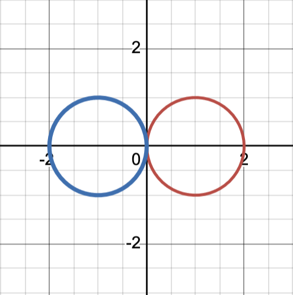
- $r = a\sin\theta$
  - The only thing that varies between the $\cos$ and $\sin$ circles is their orientation with respect to origin
  - The circle has its diameter on the y-axis, $a$ is the diameter of the circle
  - If $a \lt 0$, then the circle is below the origin, if $a \gt 0$, then the circle is above the origin
  - 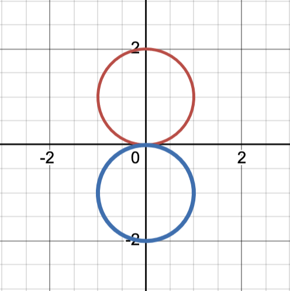
- $r = c$
  - This just makes a circle that is centered at origin
  - $c$ is the radius of the circle
  - 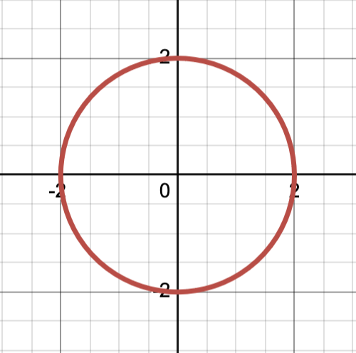
### Cardioid/Heart ($a = b$)
- General form: $a \pm b\sin\theta/a \pm b\cos\theta$
- There is a constant term being added/subtracted to the coefficient of cosine/sine
- This is when the coefficient ($b$) and the constant term ($a$) are the exact same absolute value (from the general form)
- Specific form: $r = a \pm a\cos\theta$ or $a \pm a\sin\theta$
- The sum of the constant and the coefficient tell you how far you are going to go in that direction
- Sine
  - If the second part of the equation is added, the graph points upward (green), if the second part is subtracted, the graph points downward (purple)
  - Green: $r = 1 + 1\sin\theta$
  - Purple: $r = 1 - 1\sin\theta$
  - 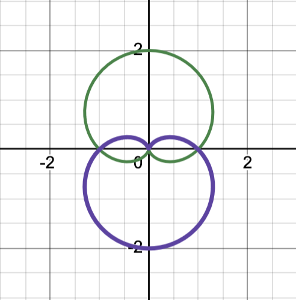
- Cosine
  - If the second part of the equation is added, the graph points right (green), if the second part is subtracted, the graph points left (purple)
  - 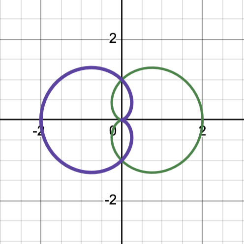
- The $r/\theta$ table can be used to help validate which direction a graph is pointing if we are unsure, just plug in an easy value for $\theta$
### Dimple ($a \gt b$)
- General form: $a \pm b\sin\theta/a \pm b\cos\theta$
- The constant term and the coefficient are not going to be the same value
- When the absolute value of the constant term ($a$) is larger than the coefficient ($b$), you have the dimple
- Sine
  - If you are adding the two terms, the graph points up (black). If you are subtracting the two terms, the graph points down (red)
  - Black: $r = 3 + 2\sin\theta$
  - Red: $r = 3 - 2\sin\theta$
  - 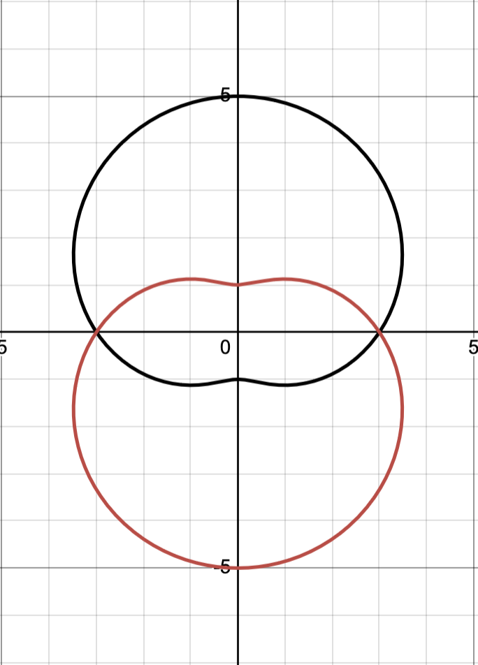
- Cosine
  - If you are adding the two terms, the graph points right (black). If you are subtracting the two terms, the graph points left (red)
  - Black = $r = 3 + 2\cos\theta$
  - Red = $r = 3 - 2\cos\theta$
  - 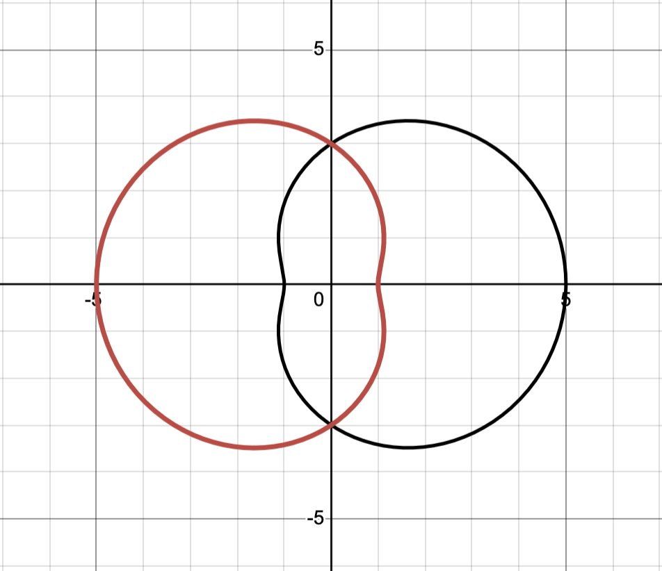
### Loop ($a \lt b$)
- General form: $a \pm b\sin\theta/a \pm b\cos\theta$
- The constant term and the coefficient are not going to be the same value
- When the absolute value of the constant term ($a$) is not larger than the coefficient ($b$), you have the loop
- Sine
  - 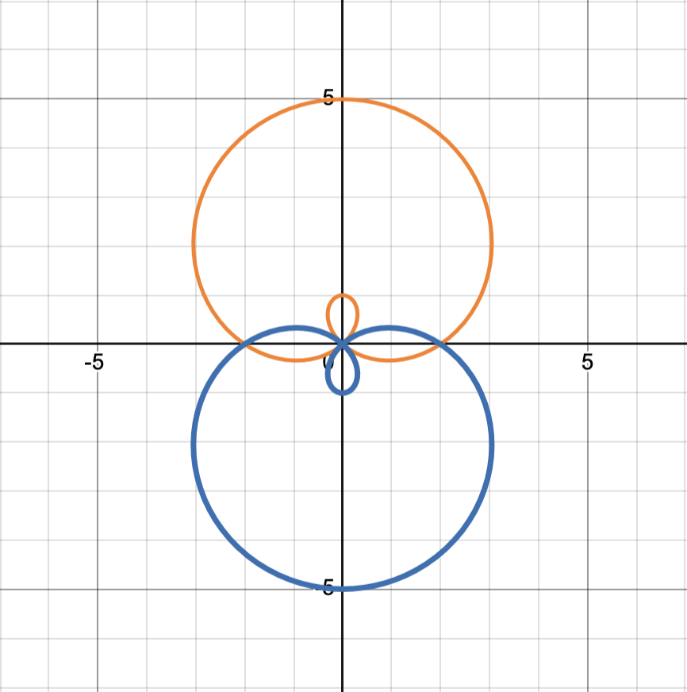
- Cosine
  - 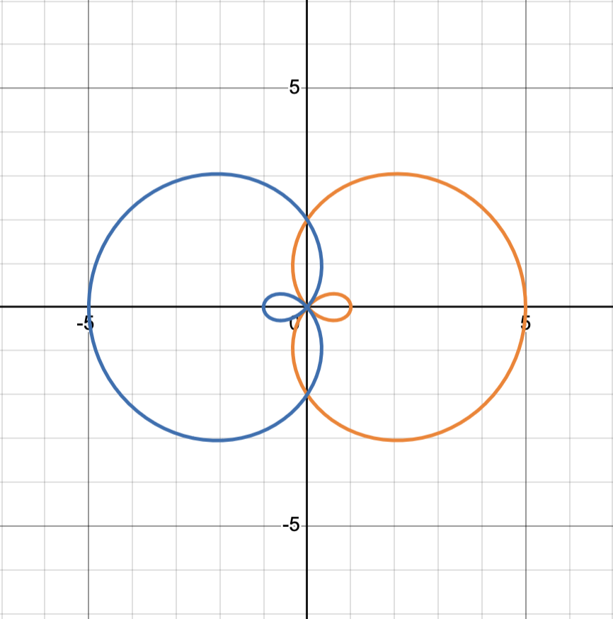
### Petals
- General form: $r = a\sin b \theta$ / $r = a\cos b \theta$
- $a$ is scalar
  - This constant tells us how far out the petals extend
- If you have an even coefficient ($b$) for $\theta$
  - Double the petals
- If you have an odd coefficient ($b$) for $\theta$
  - Same number of petals
- These always look symmetric, though the symmetry may be across both the (x,y) axes or just across one of the axes 
- Sine
  - Even coefficient: $r = 3\sin 2\theta$
  - 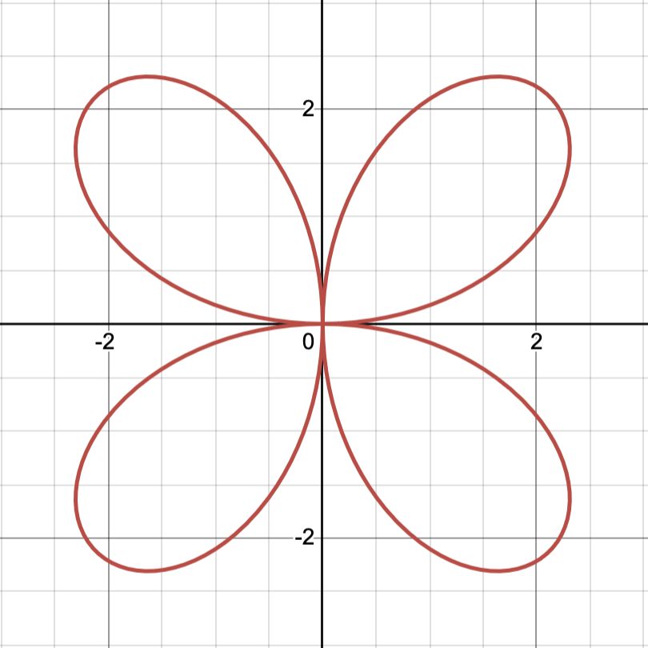
  - Odd coefficient: $r = 3\sin 3\theta$
  - 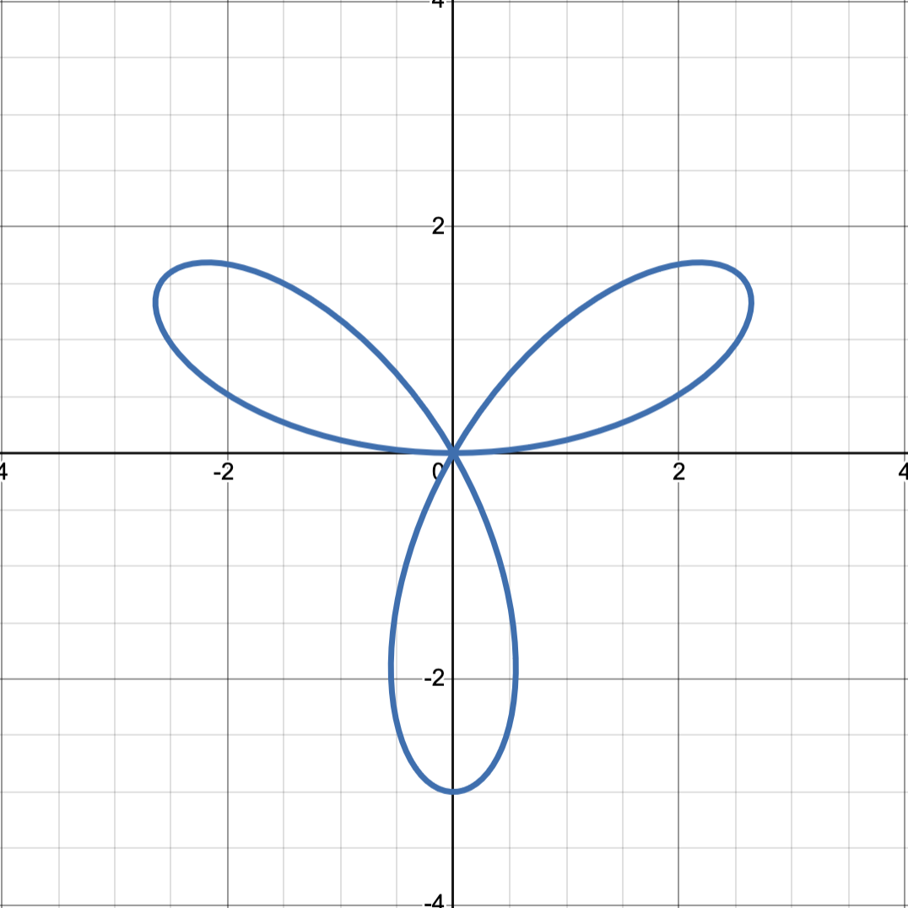
- Cosine
  - Even coefficient: $r = 3\cos 2\theta$
  - 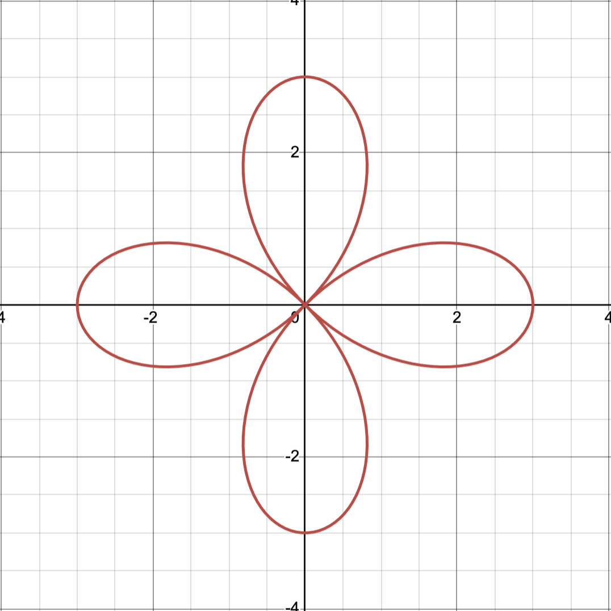
  - Odd coefficient: $r = 3\cos 3\theta$
  - 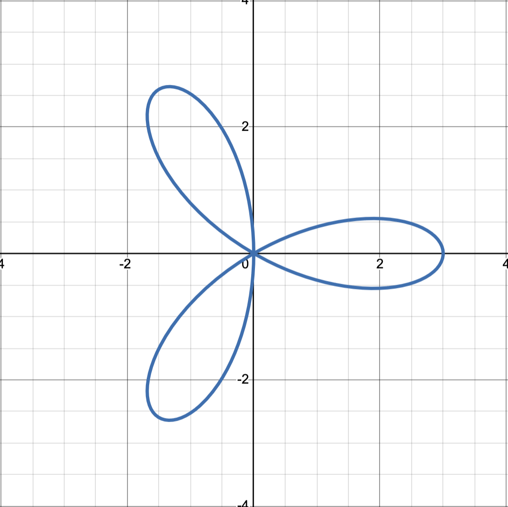