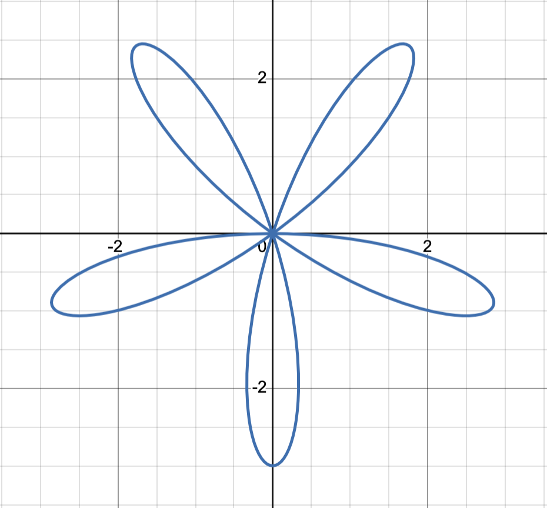
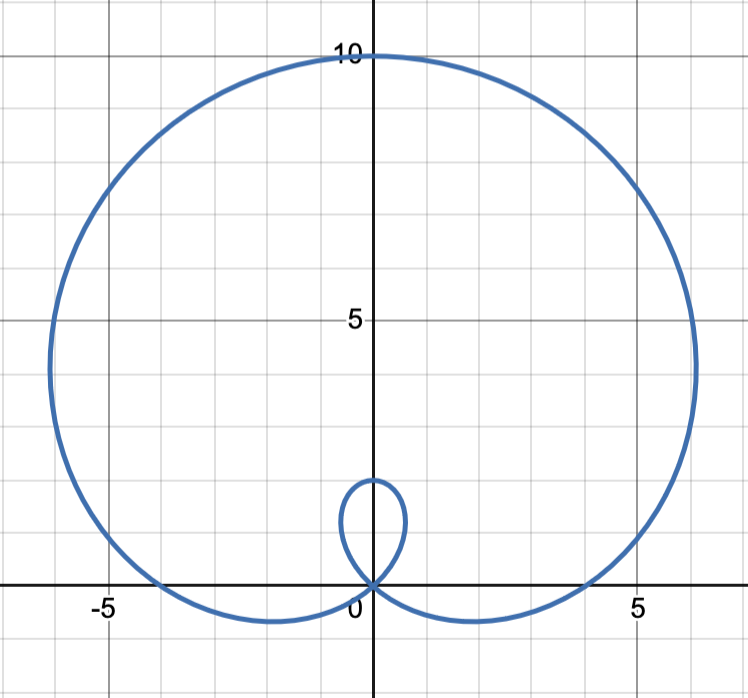
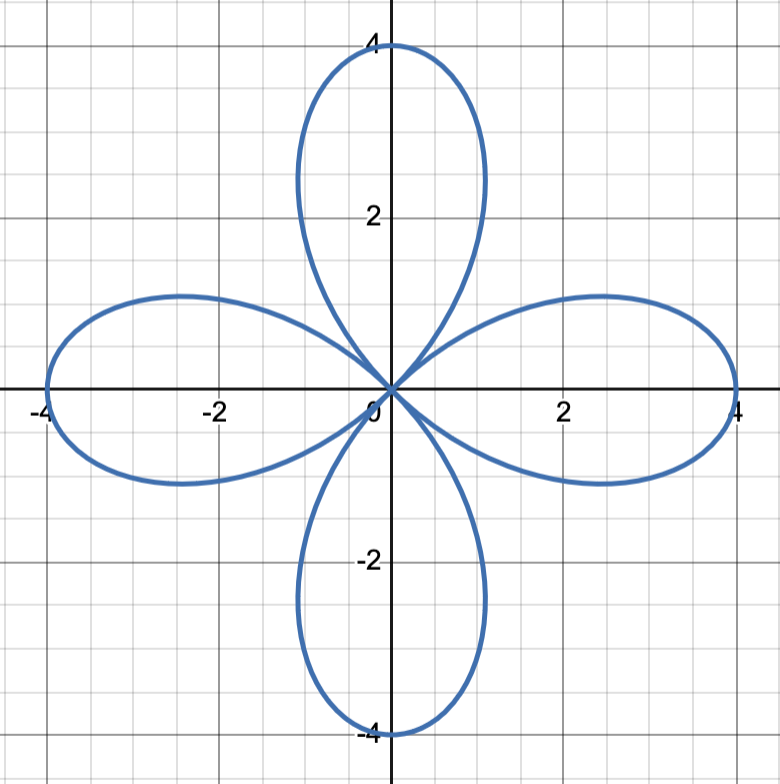

## Lecture 27: Examples of Polar Equations
- Remember that $\theta$ is the direction that you are "facing" and $r$ is how far you go in that direction
### Converting Polar $\to$ Rectangular
- Polar $\to$ rectangular: $(r, \theta) \to (x, y)$
- $\sin\theta = \frac{y}{r}$
  - With algebra, we get $y = r\sin\theta$
- $\cos\theta = \frac{x}{r}$
  - With algebra, we get $x = r\cos\theta$
- We want to find an equation that gives us the relationship between the polar coordinates and rectangular form
### Converting Rectangular $\to$ Polar
- Rectangular $\to$ polar: $(x, y) \to (r, \theta$
- $\tan\theta = \frac{y}{x}$
  - With algebra, we get $\theta = \tan^-1(\frac{y}{x})$
- $x^2 + y^2 = r^2 \to r = \pm\sqrt{x^2 + y^2}$
#### Examples
1. $r = -3\sin 5\theta$
   - Because there is a coefficient for $\theta$, we automatically know it is not one of our circles
   - We know that it has to be a petal, and because it has an odd coefficient, we know that is has the same number of petals as the coefficient
   - Our constant $-3 here) tells us how long our petals will be
   - The sine function has symmetry on the y-axis

   | $r$                               | $\theta$       |                                                      |
   |-----------------------------------|----------------|------------------------------------------------------|
   | 0                                 | 0              | $-3\sin 5(0) = -3(0)$                                |
   | -3                                | $\frac{\pi}{2} | $-3\sin(5(\frac{\pi}{2})) = -3(1)$                   |
   | $\frac{3\sqrt{2}}{2} \approx 2.1$ | $\frac{\pi}{4} | $-3\sin(5(\frac{\pi}{4})) = -3(-\frac{\sqrt{2}}{2})$ |
   | $\frac{3\sqrt{3}}{2} \approx 2.6$ | $\frac{\pi}{3} | $-3\sin(5(\frac{\pi}{3})) = -3(-\frac{\sqrt{3}}{2})$ |
   - 
2. $r = 4 + 6\sin\theta$
   - We have a constant term and a trig function, so we know that it is a cardioid, dimple, or loop
   - Because it is sine and it is adding, we know it pointing up
   - $a$ and $b$ are not the same, so it can be a dimple or a loop

   | $r$ | $\theta$                          |                                                  |
   |-----|-----------------------------------|--------------------------------------------------|
   | 10  | $\frac{\pi}{2}                    | $r = 4 + 6\sin(\frac{\pi}{2}) = 4 + 6(1) = 10$   |
   | -2  | $\frac{3\pi}{2}$/$-\frac{\pi}{2}$ | $r = 4 + 6\sin(-\frac{\pi}{2}) = 4 + 6(-1) = -2$ |
   - Because these two points are on the same side of the origin, we know that we have a loop
   - 
3. $r = 4\cos 2\theta$
   - Because it is cosine, we have symmetry over the x-axis
   - We have a coefficient in the function and it is even, so we have petals and we need four of them (double for evens)
   - Once we have our first petal ($\theta = 0$), we know we have a symmetrical petal on the opposite side of origin
   - Because we need four petals, and they are symmetrical, you know that the petals are along the y-axis

   | $r$ | $\theta$        |                      |
   |-----|-----------------|----------------------|
   | 4   | $0$             | $4\cos(2(0)) = 4(1)$ |
   - 
4. Convert $(6, \frac{\pi}{6})$ to rectangular
   - $y = 6\sin(\frac{\pi}{6}) = 6(\frac{1}{2}) = 3$
   - $x = 6\cos(\frac{\pi}{6}) = 6(\frac{\sqrt{3}}{2}) = 3\sqrt{3}$
   - $(3\sqrt{3}, 3)$
5. Convert $(2, -2)$ to polar
   - $\theta = \tan^-1(-\frac{2}{2}) = \tan^-1(-1) = -\frac{\pi}{4}$
   - $r = \sqrt{2^2 + (-2)^2} = \sqrt{8} = 2\sqrt{2}$
   - $(2\sqrt{2}, -\frac{\pi}{4})$
6. Convert $(-1, \sqrt{3})$
   - Answer: $(-2, -\frac{\pi}{3})$
   - $\theta = \tan^-1(\frac{\sqrt{3}}{1}) = -\frac{\pi}{3}$
   - $r = \pm\sqrt{(-1)^2 + \sqrt{3}^2} = \pm\sqrt{4} = -2$
   - The final $r$ is negative, because we are rotating clockwise $\frac{\pi}{3}$, which faces us towards quadrant IV. However, our original point is in quadrant II. Therefore, we need to go "backwards"
